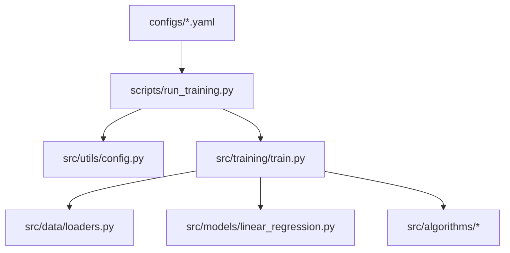

> Navigation: [Home](index.md) · [Site Map](site-map.md) · [Code Browser](code-browser.md)

# System Architecture

This markdown is the "web" of links between pieces. Start anywhere, follow the trails.

- `configs/*.yaml` → drives `scripts/run_training.py`
- `scripts/run_training.py` → loads YAML via `src/utils/config.py`, sets seeds and logging
- `src/training/train.py` → orchestrates data → model → optimizer
- `src/algorithms/*` → the optimizers selected by `training.algorithm`
- `src/models/linear_regression.py` → the example model
- `src/data/loaders.py` → synthetic data generator

## Graph (Mermaid)

- See also: [Directory Map](directory-map.md)